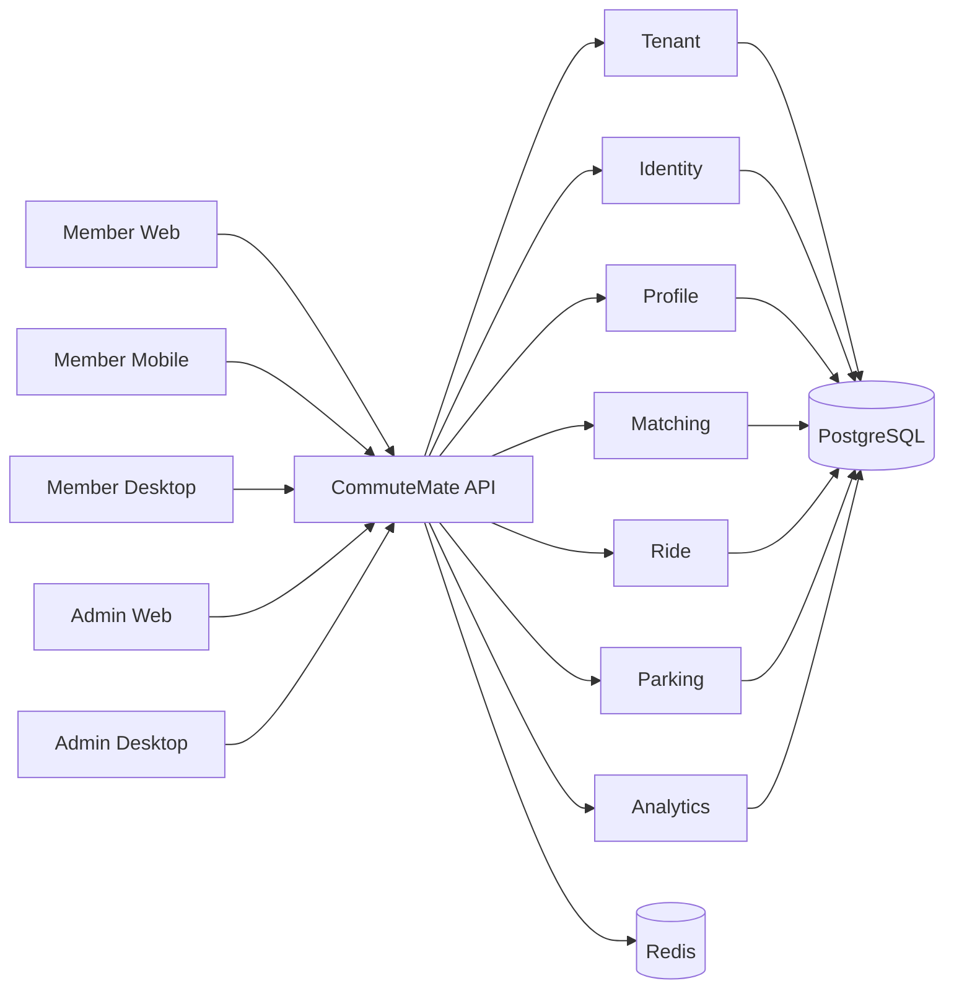
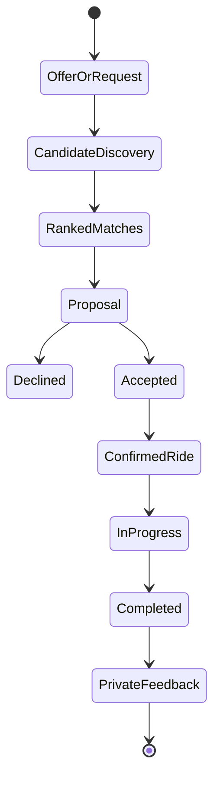

# CommuteMate

> **A multi-tenant workplace mobility platform that matches people, not just routes.**

CommuteMate helps organizations reduce parking pressure, improve commute experience, and create meaningful workplace connections through intelligent carpool matching.

Instead of only asking _“Who is going from A to B at the same time?”_, CommuteMate also asks _“Who would these people actually want to commute with?”_

The platform combines route and schedule compatibility with commute intent, rider preferences, reliability, previous ride signals, parking impact, and organization-specific objectives.

---

## Why CommuteMate?

Organizations with large offices, campuses, hospitals, universities, and distributed workplaces often face the same set of problems:

- too many single-occupancy vehicles;
- expensive or constrained parking capacity;
- frustrating return-to-office commutes;
- weak adoption of traditional carpool programs;
- limited ways to turn commuting into positive workplace connection;
- sustainability goals without an engaging employee experience.

Traditional carpool products mostly optimize logistics. CommuteMate is designed to optimize **logistics + compatibility + organizational outcomes**.

### The product thesis

**Better matches → more repeat carpools → fewer cars → lower parking pressure → better commute sentiment → stronger adoption.**

---

## What makes it different?

### 1. Match people, not only routes

A candidate can be geographically perfect and still be a poor recurring commute partner. CommuteMate supports a richer recommendation model built around:

- route compatibility;
- schedule compatibility;
- commute preferences;
- social compatibility;
- prior ride signals;
- reliability;
- parking impact;
- tenant-specific policy weights.

### 2. Commute Intent

A member's preference can change by day. A future matching request may express an intent such as:

- **Quiet** — optimize for a low-interaction commute;
- **Social** — prefer compatible conversational riders;
- **Networking** — encourage new professional connections;
- **Fastest** — prioritize route and time efficiency;
- **Max Impact** — prioritize vehicle reduction / occupancy benefit.

The matching engine should adjust ranking without forcing users into one permanent persona.

### 3. Tenant-configurable Matching Policy Engine

CommuteMate is not a white-label app where every organization gets the same algorithm with a different logo.

Each tenant can eventually tune the objectives that matter to its program. For example:

```text
Route            30%
Schedule         20%
Preferences      15%
Social fit       10%
Ride history     10%
Parking impact   10%
Reliability       5%
```

A hospital may emphasize schedule reliability. A university may emphasize trusted-community constraints. A corporate campus with a parking shortage may emphasize occupancy and parking impact.

### 4. Built as a multi-tenant platform from day one

CommuteMate is designed for many independent organizations:

```text
CommuteMate Platform
│
├── Organization A
│   ├── Campus 1
│   └── Campus 2
├── Organization B
│   └── Headquarters
├── University C
│   └── Main Campus
└── Hospital Network D
    ├── Day Shift
    └── Night Shift
```

Tenant isolation is an architectural boundary, not a UI filter.

### 5. Privacy-first workplace matching

This is workplace mobility software, not a public popularity system.

Key principles:

- minimize storage and exposure of precise home addresses;
- prefer coarse origin/geospatial cells for discovery;
- reveal pickup details only after mutual acceptance;
- never expose rejection reasons;
- keep compatibility feedback private;
- prefer private signals such as **Ride again / Fine / Prefer different match** over public star ratings;
- aggregate employer analytics and avoid employee-surveillance patterns.

---

## Product surfaces

CommuteMate is intended to provide a complete mobility platform rather than one application.

| Surface | Purpose | Current state |
|---|---|---|
| `member-web` | Member carpool experience in the browser | Foundation |
| `member-mobile` | iOS / Android member experience | Foundation |
| `member-desktop` | Desktop member wrapper | Foundation |
| `admin-web` | Mobility / tenant administration | Foundation |
| `admin-desktop` | Desktop admin wrapper | Foundation |
| `backend` | Java/Spring Boot platform API | v0.2 / early v0.3 |
| `db` | PostgreSQL schema + development data | Foundation |
| `infra` | Local infrastructure | Foundation |

---

## Architecture

### Current strategy: modular monolith

CommuteMate intentionally starts as a **modular monolith**, not microservices.

That keeps development, testing, deployment, and debugging manageable while the product is still discovering its true scaling boundaries. Domain seams are kept explicit so a module can be extracted later if real operational evidence justifies it.



### Domain boundaries

- **Tenant** — organizations, branding, policies, locations, program configuration.
- **Identity** — users, memberships, roles, SSO subject mapping.
- **Profile** — commute preferences, compatibility traits, privacy preferences.
- **Matching** — candidate generation, scoring, policy weighting, explanations.
- **Ride** — offers, requests, proposals, acceptance, confirmed and recurring rides.
- **Parking** — capacity, reservations, carpool priority, occupancy impact.
- **Analytics** — aggregate adoption, vehicle reduction, sustainability and sentiment outcomes.

See [`docs/architecture.md`](docs/architecture.md) and [`docs/domain-model.md`](docs/domain-model.md).

---

## Tenant and identity model

A platform user is not the same thing as an organization membership.

A user may eventually belong to multiple tenants, while each membership carries its own roles and tenant-specific profile/context.

Current roles:

- `PLATFORM_ADMIN`
- `TENANT_ADMIN`
- `MOBILITY_ADMIN`
- `MEMBER`

Normal tenant APIs must derive tenant context from authenticated membership. A client must not be allowed to select an arbitrary tenant ID and gain access to another organization's data.

The current development identity mechanism uses request headers for local development only. It must never become the production authentication model.

---

## Matching model

The current repository contains the first matching kernel. The long-term system should have two explicit stages.

### Stage 1 — candidate generation

Apply hard constraints before scoring:

- same tenant / eligible community;
- compatible destination/location;
- geographic pickup feasibility;
- time-window overlap;
- available seats;
- member / program eligibility;
- safety and privacy rules;
- explicit blocks or exclusions.

### Stage 2 — ranking

Rank viable candidates using a tenant policy plus request-time commute intent.

Conceptually:

```text
score(A, B, tenant, intent) =
    routeCompatibility
  + scheduleCompatibility
  + preferenceCompatibility
  + socialCompatibility
  + previousRideSignals
  + reliability
  + parkingImpact
  + tenantPolicyAdjustments
  + commuteIntentAdjustments
```

Scores should be explainable in user-friendly language without revealing private attributes or rejection reasons.

---

## Ride lifecycle

The target lifecycle is:



The repository currently implements the first backend slices of offers, discovery, proposals, acceptance and confirmed rides.

---

## Employer / tenant outcomes

CommuteMate should eventually make its value measurable through aggregate program analytics such as:

- shared commutes;
- active carpoolers;
- estimated peak vehicles avoided;
- parking capacity impact;
- miles shared;
- estimated emissions reduction;
- repeat-match rate;
- positive private ride feedback;
- cross-team / new-connection measures where privacy rules permit;
- commute program adoption and retention.

The goal is to sell **mobility outcomes**, not merely a carpool search screen.

---

## Repository structure

```text
commutemate-platform/
├── admin-web/          Angular admin experience
├── admin-desktop/      Electron admin shell
├── member-web/         Angular member experience
├── member-mobile/      Expo / React Native member experience
├── member-desktop/     Electron member shell
├── backend/            Java 21 + Spring Boot modular monolith
├── db/                 Database helpers / development seed
├── infra/              Local infrastructure
├── docs/               Product + architecture documentation
├── AGENTS.md            Repository instructions for coding agents
└── CODEX_BUILD_PROMPT.md Long-form Codex continuation prompt
```

---

## Technology direction

Current foundation:

- **Backend:** Java 21, Spring Boot, Maven
- **Database:** PostgreSQL + Flyway
- **Cache / future coordination:** Redis
- **Admin web:** Angular
- **Member web:** Angular
- **Mobile:** Expo / React Native
- **Desktop:** Electron shells
- **Infrastructure:** Docker Compose for local dependencies

Do not introduce a new framework, message broker, database, or service boundary simply because it is fashionable. Add infrastructure only when a concrete product or operational requirement justifies it.

---

## Local development

### Prerequisites

- Java 21+
- Maven
- Node.js 22.22.3+, 24.15.0+, or 26+ / npm
- Docker + Docker Compose

### Start local infrastructure

```bash
docker compose -f infra/docker-compose.yml up -d
```

### Start backend

```bash
cd backend
mvn spring-boot:run
```

Flyway owns schema migrations. Development seed data is available under `db/seed-dev.sql`.

### Verify the repository

Run the same checks used by CI:

```bash
(cd backend && mvn --batch-mode verify)
(cd admin-web && npm ci && npm run typecheck && npm run build)
(cd member-web && npm ci && npm run typecheck && npm run build)
(cd member-mobile && npm ci && npm run typecheck)
```

The backend currently has unit tests for the matching kernel. The web and mobile foundations have strict type/build checks but do not yet have component test suites; add those alongside the first interactive vertical slices.

GitHub Actions runs these checks for pull requests and pushes to `main` via [`.github/workflows/ci.yml`](.github/workflows/ci.yml).

### Development identity

The current local-only identity flow uses:

```text
X-Tenant-Slug
X-User-Email
```

This is intentionally a development convenience. Production deployments must use real authentication/OIDC/SSO and validated membership context.

---

## Current status

### Implemented / started

- multi-tenant organization model;
- platform users and tenant memberships;
- tenant roles;
- development tenant identity context;
- tenant-scoped locations;
- member profiles / preferences;
- ride offers;
- ride discovery;
- match proposals;
- driver accept / decline;
- confirmed rides;
- seat inventory adjustment on acceptance;
- matching score kernel + explanations;
- Flyway migrations;
- application shells for member/admin surfaces.

### Important next work

1. Make the complete repository build and test green in CI.
2. Replace local header identity with production-ready OIDC seams while retaining a safe local profile.
3. Complete ride request + proposal + acceptance lifecycle and enforce invariants transactionally.
4. Implement real candidate generation with geospatial and time-window constraints.
5. Make matching policy tenant-configurable and auditable.
6. Introduce commute intent into ranking.
7. Complete member and admin vertical slices against real APIs.
8. Add notifications and recurring commute patterns.
9. Build parking inventory / priority integration.
10. Add aggregate tenant analytics and privacy thresholds.

See [`docs/roadmap.md`](docs/roadmap.md).

---

## Engineering principles

1. **Tenant isolation first.** Every tenant-owned read and write must be scoped.
2. **Prefer vertical slices.** A small feature that works end-to-end beats disconnected layers.
3. **Modular monolith until evidence says otherwise.**
4. **Privacy is a product feature.**
5. **No public social scoring.** Use private recommendation signals.
6. **Explain matching without leaking sensitive preferences.**
7. **Keep the algorithm configurable, observable and testable.**
8. **Do not hard-code one employer's policies or terminology.**
9. **Build for organizations, but design an excellent member experience.**
10. **Tests are part of the feature.**

---

## Working with Codex

This repository includes [`AGENTS.md`](AGENTS.md), which contains durable coding-agent instructions, and [`CODEX_BUILD_PROMPT.md`](CODEX_BUILD_PROMPT.md), which contains a comprehensive continuation task.

A good workflow is:

1. connect this GitHub repository to Codex;
2. allow Codex to inspect the repository and run the baseline tests;
3. give it the prompt in `CODEX_BUILD_PROMPT.md`;
4. ask it to work milestone-by-milestone and produce reviewable PRs rather than one giant rewrite;
5. review architecture changes before accepting new infrastructure or service boundaries.

---

## Product stage

CommuteMate is currently an early-stage independent product foundation. The goal is to evolve it into a production-quality multi-tenant mobility platform suitable for companies, campuses, universities, hospitals, and other trusted communities.

---

## License

See [`LICENSE`](LICENSE).
